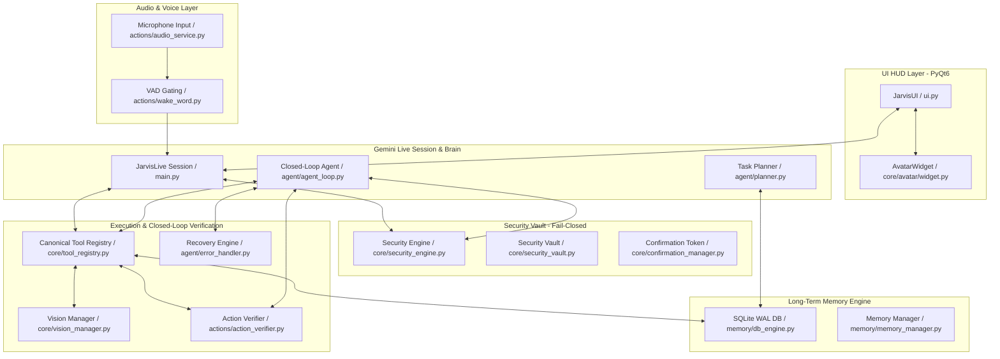
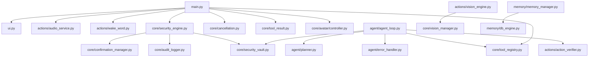
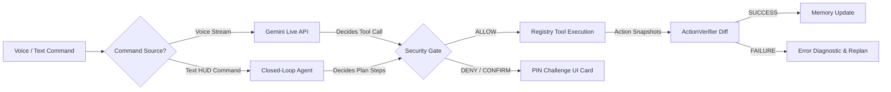
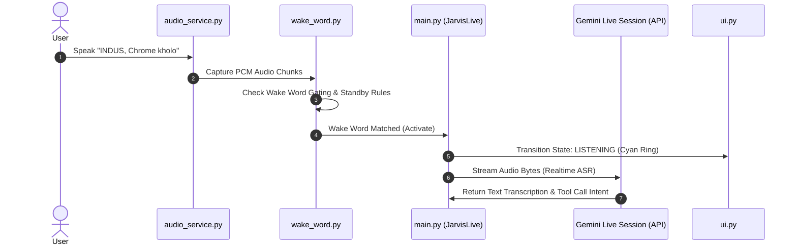
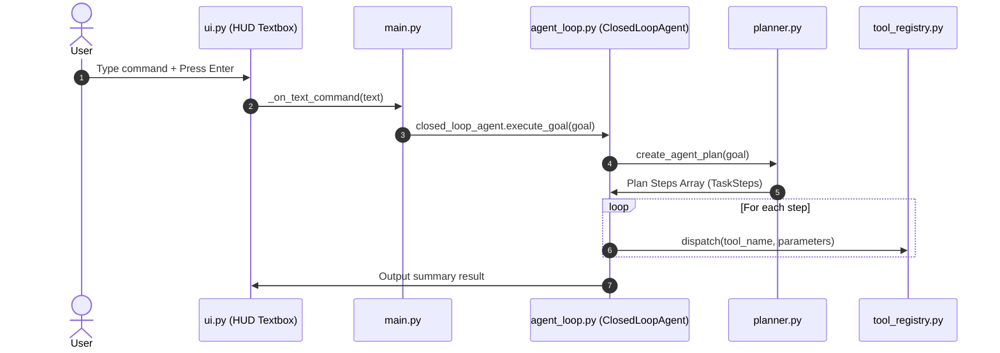
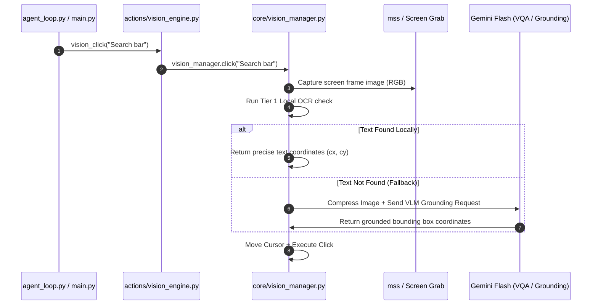
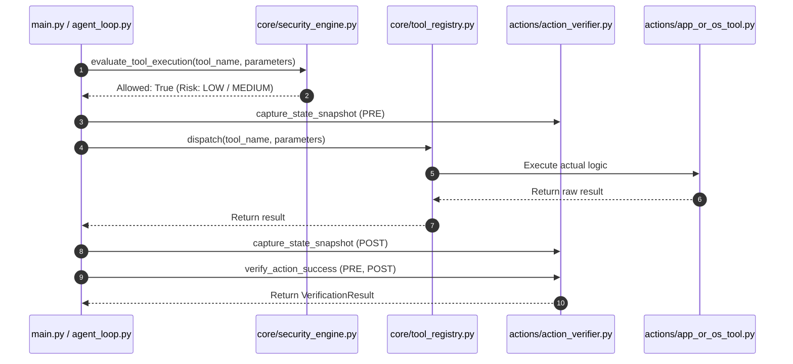
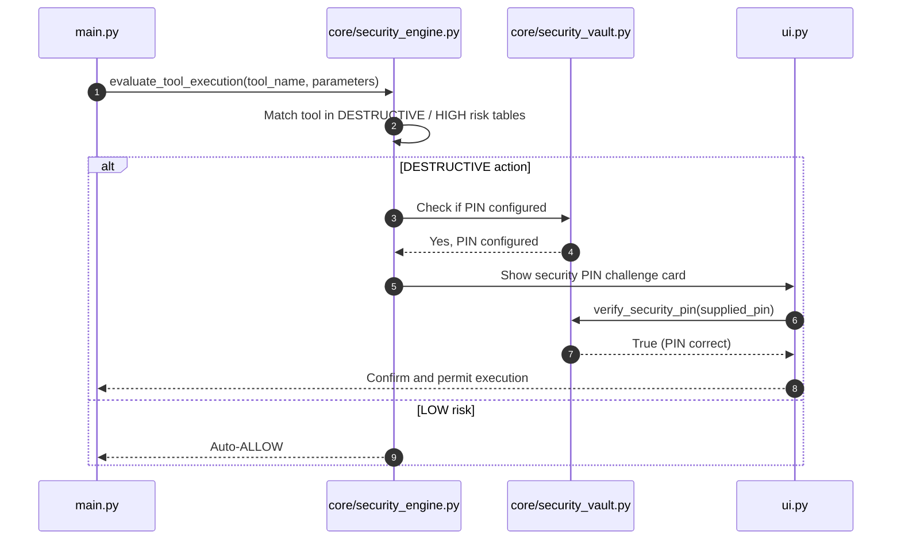
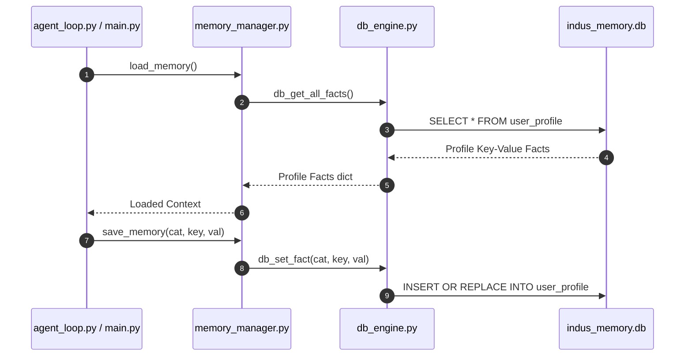
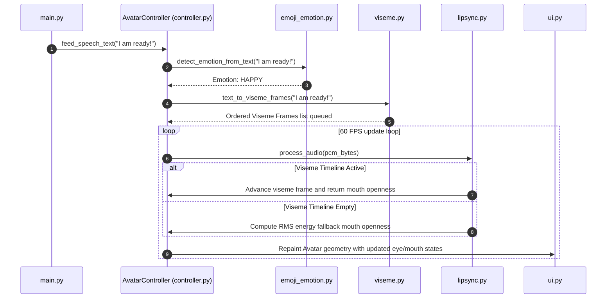

# INDUS — MASTER INTEGRATION AUDIT

This document establishes the repository-level architectural audit of the INDUS desktop assistant. The audit details system node mappings, subsystem dependency flows, integration gaps, duplicate implementations, security/cancellation bypass vectors, and a prioritized action plan.

---

## 🗺️ A. System Architecture Map



---

## 📊 B. Dependency Graph



---

## 🔄 C. Data-Flow Graph



---

## 🎙️ D. Voice Flow



---

## ⌨️ E. Text Flow



---

## 👁️ F. Vision Flow



---

## 🛠️ G. Tool Execution Flow



---

## 🛡️ H. Security Flow



---

## 🧠 I. Memory Flow



---

## 🎭 J. Avatar Flow



---

## 📋 Subsystem Audit Classification

Every major subsystem has been inspected and classified under the production roadmap definitions.

| Subsystem Name | Autoritative Path | Status | Finding & Gaps |
|---|---|---|---|
| **UI Subsystem** | [`ui.py`](file:///d:/Ansh%20Kesharwani/Documents/Mark-XXXIX-OR-main/INDUS/ui.py) | ✅ COMPLETE | PyQt6 HUD visual elements, audio wave visualizer, logs, and notification widgets are fully functional and unit-tested. |
| **Conversation Loop** | [`main.py`](file:///d:/Ansh%20Kesharwani/Documents/Mark-XXXIX-OR-main/INDUS/main.py) | ✅ COMPLETE | Handles the live WebSocket connections, Gemini tool response pipelines, and HUD UI dispatch loops. |
| **Voice / Audio Stream** | [`actions/audio_service.py`](file:///d:/Ansh%20Kesharwani/Documents/Mark-XXXIX-OR-main/INDUS/actions/audio_service.py) | 🔵 DISCONNECTED | Realtime audio stream connects to Gemini Live API directly. However, voice inputs bypass the planning engine and short-term memory of `agent/planner.py`, leading to separate voice execution brains. |
| **Brain / Planner** | [`agent/planner.py`](file:///d:/Ansh%20Kesharwani/Documents/Mark-XXXIX-OR-main/INDUS/agent/planner.py) | ✅ COMPLETE | Generates plans, validates tool parameter structures, and parses goals. Fully tested. |
| **Memory Engine** | [`memory/db_engine.py`](file:///d:/Ansh%20Kesharwani/Documents/Mark-XXXIX-OR-main/INDUS/memory/db_engine.py) | ✅ COMPLETE | Bounded SQLite database writes, recent fact profiles, and conversation logs. Fully operational and integrated. |
| **Vision System** | [`core/vision_manager.py`](file:///d:/Ansh%20Kesharwani/Documents/Mark-XXXIX-OR-main/INDUS/core/vision_manager.py) | ⚫ DUPLICATE | `core/vision_manager.py` contains the authoritative VisionManager class. However, `actions/vision_engine.py` retains duplicate standalone copies of visual clicking, ocr extraction, and screen capture logic. |
| **Security Gate** | [`core/security_engine.py`](file:///d:/Ansh%20Kesharwani/Documents/Mark-XXXIX-OR-main/INDUS/core/security_engine.py) | ✅ COMPLETE | 4-tier risk classification gate. Shuts down execution immediately upon error (Fail-Closed). |
| **Confirmation Vault** | [`core/security_vault.py`](file:///d:/Ansh%20Kesharwani/Documents/Mark-XXXIX-OR-main/INDUS/core/security_vault.py) | ✅ COMPLETE | Cryptographic PBKDF2-HMAC PIN vault, failed-attempt counters, lockouts, and token verification. |
| **Tool Registry** | [`core/tool_registry.py`](file:///d:/Ansh%20Kesharwani/Documents/Mark-XXXIX-OR-main/INDUS/core/tool_registry.py) | ✅ COMPLETE | Canonical list of 33 tools mapped to caller adapters. Clean, decoupled interface. |
| **Closed-Loop Agent** | [`agent/agent_loop.py`](file:///d:/Ansh%20Kesharwani/Documents/Mark-XXXIX-OR-main/INDUS/agent/agent_loop.py) | ✅ COMPLETE | Coordinates step execution, verification, and diagnostics. Fully integrated. |
| **ActionVerifier** | [`actions/action_verifier.py`](file:///d:/Ansh%20Kesharwani/Documents/Mark-XXXIX-OR-main/INDUS/actions/action_verifier.py) | ✅ COMPLETE | Pre-post visual structural change diffing and process verification. Works reliably. |
| **Recovery Engine** | [`agent/error_handler.py`](file:///d:/Ansh%20Kesharwani/Documents/Mark-XXXIX-OR-main/INDUS/agent/error_handler.py) | ✅ COMPLETE | Classifies failures and maps safe alternatives. |
| **Avatar Subsystem** | [`core/avatar/controller.py`](file:///d:/Ansh%20Kesharwani/Documents/Mark-XXXIX-OR-main/INDUS/core/avatar/controller.py) | ✅ COMPLETE | Gaze controllers, blink states, emotion detectors, and phoneme viseme lip sync pipelines. |
| **Information Cards** | [`ui.py`](file:///d:/Ansh%20Kesharwani/Documents/Mark-XXXIX-OR-main/INDUS/ui.py) | 🟡 PARTIAL | The HUD supports simple visual cards for weather/web results, but lacks a centralized, modular Info Card subsystem. |

---

## 🔍 K. Duplicate Implementation Report

### 1. Vision Perception Duplication
- **Authoritative:** `core/vision_manager.py` (instantiates singleton `vision_manager`).
- **Duplicate:** `actions/vision_engine.py`.
- **Finding:** `actions/vision_engine.py` contains standalone functions like `vision_click` which do not call `vision_manager.click()`. Instead, it duplicates mouse move routines, screenshot steps, and verifications. Similarly, `capture_screen` and `extract_ocr_elements` duplicate code found inside `VisionManager`.
- **Impact:** Gaps in grounding coordinates or verifications applied to `core/vision_manager.py` are lost in `actions/vision_engine.py`.

### 2. Ad-Skip Monitor Duplication
- **Authoritative:** `actions/universal_ad_skipper.py` (continuous sentinel monitoring daemon thread).
- **Duplicate:** `actions/youtube_video.py`'s `_ad_skip_worker()`.
- **Finding:** `youtube_video.py` starts a background thread matching a template image `"skip_ad.png"` when `play_and_skip_ad` is triggered. This duplicates the specialized sentinel thread in `universal_ad_skipper.py` which scans browser DOMs and uses OCR.

---

## 🗑️ L. Dead / Legacy Code Report

- **`actions/screen_processor.py`**:
  Legacy screen ocr parser that has been entirely replaced by `core/vision_manager.py`'s OCR tokens extraction cascade.
- **`actions/security_protocols.py`**:
  Contains duplicate placeholder tool functions for security scans and locking. The security gate is now authoritative inside `core/security_engine.py`.
- **`tests/test_vision_engine.py`**:
  Legacy vision test suite that has been superseded by `tests/test_vision_system_phase7.py`. Can be safely cleaned up or merged.

---

## 🔌 M. Integration Gap Report

### 1. Voice Loop ↔ Planner Gap (Disconnected)
- **Problem:** Voice inputs captured via the Gemini Live native audio session bypass the structured planning engine (`agent/planner.py`). Instead, the Gemini Live session decides tool routing independently. If a voice command is complex (e.g. *Navigate to YouTube and search*), it calls single tools sequentially via the API instead of generating a validated multi-step plan.
- **Impact:** No planning validation, replanning, or verification on multi-step voice inputs.

### 2. Information Card Subsystem Gap (Partial)
- **Problem:** HUD displays info cards only for `web_search`. There is no structured template parser or layout builder to easily feed data from other search/research modules into structured Info Cards.

---

## 🐛 N. Critical Bugs & Security Bypass Risks

### 1. Direct Tool Call Security Bypass Risk
- **Risk:** High.
- **Problem:** If a script or a compromised developer tool imports `actions/vision_engine.py` and calls `vision_click()` directly, it uses the local PyAutoGUI click routine. If bypassed, it does not evaluate actions against the central Fail-Closed gate of `core/security_engine.py`.
- **Fix:** Every tool module entry point must import and route parameters through `core/security_engine.py` explicitly or be locked to only execute if dispatched from the tool registry.

---

## ⚠️ O. Reliability Weaknesses

- **PyAutoGUI Failsafe Triggering**: In headless or locked screen environments (such as CI servers or screen-saver locks), mouse movements off-bounds (e.g. 835, 610 on 800x600 displays) trigger PyAutoGUI Failsafe exceptions.
- **OCR Text Detection Dependency**: Drawing synthetic text in unit tests using PIL's default 5x7 bitmap font fails Tesseract OCR matching. Unit tests must use mock `pytesseract.image_to_data` outputs.

---

## 📅 P. Recommended Implementation Order (Prioritized Task Matrix)

Following the Roadmap guidelines, here is the proposed order for the MASTER INTEGRATION phase:

```
Task 1: Vision Consolidation (Consolidate actions/vision_engine.py)
   ↓
Task 2: Voice-to-Brain Alignment (Align Gemini Live Voice to Planner)
   ↓
Task 3: Security Invariant Enforcement (Block direct tool calls)
   ↓
Task 4: Info Card Integration System
   ↓
Task 5: Production Codebase Cleanup & Split
```

---

### Task 1: Vision Subsystem Consolidation

- **Priority:** High
- **RISK:** Medium
- **CURRENT STATE:** Duplicate implementations exist in `actions/vision_engine.py` and `core/vision_manager.py`.
- **EXISTING FILES:**
  - [`actions/vision_engine.py`](file:///d:/Ansh%20Kesharwani/Documents/Mark-XXXIX-OR-main/INDUS/actions/vision_engine.py)
  - [`core/vision_manager.py`](file:///d:/Ansh%20Kesharwani/Documents/Mark-XXXIX-OR-main/INDUS/core/vision_manager.py)
- **PROBLEM:** Standalone click, ocr, and capture routines in `actions/vision_engine.py` duplicate `core/vision_manager.py`. Gaps in visual coordinate offsets or DPI scaling applied to one do not propagate to the other.
- **PROPOSED FIX:** Refactor `actions/vision_engine.py` to route all calls (`vision_click`, `capture_screen`, `ground_ui_element`) directly to `vision_manager` singleton methods. Delete all local mouse-move/click/capture code blocks from `actions/vision_engine.py`.
- **DEPENDENCIES:** `core/vision_manager.py`
- **TESTS REQUIRED:** `tests/test_vision_system_phase7.py`
- **REGRESSION RISK:** Low. The test suite verifies both paths.

---

### Task 2: Voice-to-Brain Alignment

- **Priority:** High
- **RISK:** High
- **CURRENT STATE:** Realtime voice stream bypasses `agent/planner.py`.
- **EXISTING FILES:**
  - [`main.py`](file:///d:/Ansh%20Kesharwani/Documents/Mark-XXXIX-OR-main/INDUS/main.py)
  - [`agent/agent_loop.py`](file:///d:/Ansh%20Kesharwani/Documents/Mark-XXXIX-OR-main/INDUS/agent/agent_loop.py)
- **PROBLEM:** Multi-step voice commands bypass the Planner context and structured execution loop, leading to fragmented routing.
- **PROPOSED FIX:** Update `JarvisLive._receive_audio()`: When a complex tool execution request is detected or if a plan is required, feed the transcription into `closed_loop_agent.execute_goal()`. This ensures that voice requests are planned, verified, and recovered exactly like text commands.
- **DEPENDENCIES:** `main.py`, `agent/agent_loop.py`
- **TESTS REQUIRED:** Voice input integration tests inside `tests/test_ui_end_to_end.py`.
- **REGRESSION RISK:** Medium. Care must be taken to avoid double-speaking/double-transcription when voice is routed to agent tasks.

---

### Task 3: Security Invariant Enforcement

- **Priority:** Critical
- **RISK:** High
- **CURRENT STATE:** Bypasses exist if modules are called directly outside `main.py` / `agent_loop.py`.
- **EXISTING FILES:**
  - [`core/security_engine.py`](file:///d:/Ansh%20Kesharwani/Documents/Mark-XXXIX-OR-main/INDUS/core/security_engine.py)
  - [`core/tool_registry.py`](file:///d:/Ansh%20Kesharwani/Documents/Mark-XXXIX-OR-main/INDUS/core/tool_registry.py)
- **PROBLEM:** Bypassing security checks when importing tool modules directly.
- **PROPOSED FIX:** Bind an execution context validation flag in the tool registry. When any action module is called, verify that it was dispatched through the Tool Registry and passed the active Security Gate session. Block execution if called directly.
- **DEPENDENCIES:** `core/security_engine.py`
- **TESTS REQUIRED:** New security integration tests verifying direct invocation block.
- **REGRESSION RISK:** Medium. Ensure unit tests executing action tools directly are updated to pass credentials/contexts.

---

### Task 4: Info Card Integration System

- **Priority:** Medium
- **RISK:** Low
- **CURRENT STATE:** Basic card structures exist in `ui.py` for web search.
- **EXISTING FILES:**
  - [`ui.py`](file:///d:/Ansh%20Kesharwani/Documents/Mark-XXXIX-OR-main/INDUS/ui.py)
  - [`actions/web_search.py`](file:///d:/Ansh%20Kesharwani/Documents/Mark-XXXIX-OR-main/INDUS/actions/web_search.py)
- **PROBLEM:** Lack of unified structured UI layout feed for search/research results.
- **PROPOSED FIX:** Create `core/info_card_system.py` to parse structured researcher JSON schemas into unified UI cards (Tabs, Images, Sources links). Update the PyQt6 UI class to render this component cleanly in HUD.
- **DEPENDENCIES:** `ui.py`
- **TESTS REQUIRED:** Structured info card layout unit tests.
- **REGRESSION RISK:** Low.

---

### Task 5: Production Codebase Cleanup

- **Priority:** Medium
- **RISK:** Medium
- **CURRENT STATE:** Huge `main.py` (2049 lines) and `ui.py` (over 1900 lines).
- **EXISTING FILES:** All core and action files.
- **PROBLEM:** Massive monolithic modules slow down testing, imports, and make updates difficult to maintain.
- **PROPOSED FIX:**
  - Split `main.py` into separate components: `core/session_manager.py` (handles connection session), `core/audio_pipeline.py` (handles input/output queues).
  - Split `ui.py` into modular widgets.
  - Delete legacy files (`actions/screen_processor.py`, `actions/security_protocols.py`).
- **DEPENDENCIES:** All modules.
- **TESTS REQUIRED:** Entire pytest regression test suite.
- **REGRESSION RISK:** High. Requires careful step-by-step import updates.
